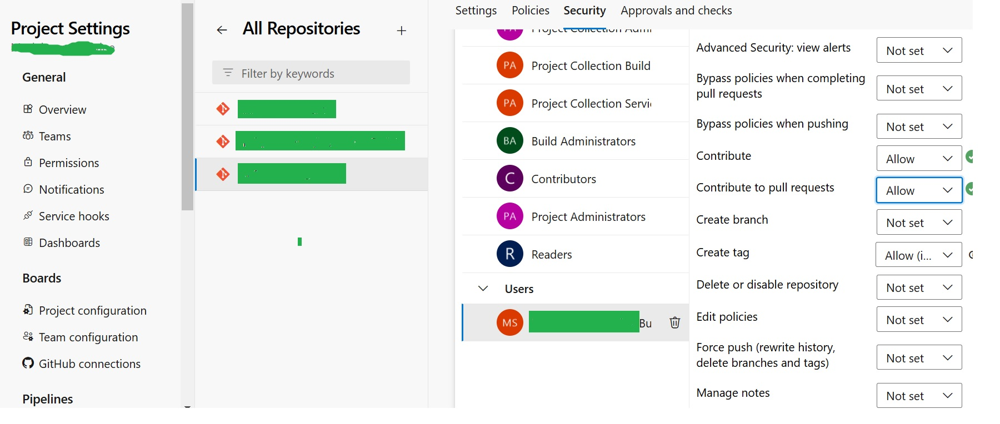

Aby zsynchronizować zmienną wskazującą na aktualne środowisko dev, test lub prod, w pliku konfiguracyjnym (przykładowo 'config_file.py') należy utworzyć PIPLINE, najlepiej bazujący na  pliku YMAL:


Aby plik YMAL mógł wykonać 'commit' zmian do danego środowiska, należy nadać uprawnienia 'Contribute' oraz 'Contribute to pull reqests' dla grupy 'Project Name' Build Serice '[Organization Name] dla danego repozytorium na którym mają być zmiany:


(Project Setting -> Repositories -> Nazwa Repo -> Security)





Przykład pliku YMAL:

```yaml
trigger:

  branches:

    include:

      - "*"  # This will trigger the pipeline for all branches

  
  

pool:

  vmImage: 'ubuntu-latest'

  

steps:

          # Checkout the repository explicitly using the built-in script

          - checkout: self

            persistCredentials: true #Important - Persist creds to run further git command

            clean: true

  
  

          # Determine the branch name and update Env_config

          - script: |

              echo "## Determining the branch name..."

              BRANCH_NAME=$(Build.SourceBranchName)

              echo "Branch name: $BRANCH_NAME"

  

              # Set SCHEMA_NAME based on the branch name

              if [ "$BRANCH_NAME" = "main" ]; then

                SCHEMA_NAME="model"

              else

                SCHEMA_NAME="model_$BRANCH_NAME"

              fi

              echo "Schema name: $SCHEMA_NAME"

  

              # update config file

              sed -i "s/BRANCH_NAME = .*/BRANCH_NAME = \"$BRANCH_NAME\"/" ./config_file_SUPPLY_DEMAND_MODELS.py

              sed -i "s/SCHEMA = .*/SCHEMA = \"$SCHEMA_NAME\"/" ./config_file_SUPPLY_DEMAND_MODELS.py

  

            displayName: Update Config File

          # Commit and push the changes

          - script: |

              echo "## Committing changes..."

              git config --global user.email "$(Build.RequestedForEmail)"

              git config --global user.name "Azure Pipelines"

  

              git add ./config_file_SUPPLY_DEMAND_MODELS.py

  

              git commit -m "Set BRANCH_NAME and SCHEMA_NAME to $BRANCH_NAME for branch $(Build.SourceBranchName)"

              git push origin HEAD:$(Build.SourceBranchName)

            displayName: Commit Changes
```


Przykład pliku 'config_file_SUPPLY_DEMAND_MODELS.py':

```python
# Configuration for the environment

BRANCH_NAME = "test"

SCHEMA = "model_test"

dbutils.notebook.exit(f"{BRANCH_NAME}|{SCHEMA}")
```
